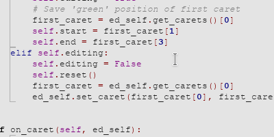

#  Cuda Sync Editing
Sync Editing feature to edit identical identifiers (inspired by [SynWrite](http://uvviewsoft.com/synwrite/))

### Showcase

### Using
1. Select text that you want to edit
2. Menu `Plugins/SyncEditing/Toggle` to enable Sync Editing mode
3. Click on the identifier that you want to edit
4. Edit it
5. Click somewere else, leave line or click on menu `Plugins/SyncEditing/Reset` to leave Sync Editing mode
