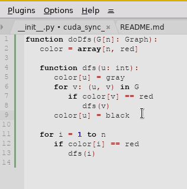

#  Cuda Sync Editing
Sync Editing feature to edit identical identifiers (inspired by [SynWrite](http://uvviewsoft.com/synwrite/))

### Showcase

### Usage
1. Select block (one or several lines), containing some ID's (identifiers)
2. Activate plugin by menu item: `Plugins / Sync Editing / Toggle`
3. Selection is removed but plugin colorizes that block in different color
4. Click on any ID in that block, which you want to edit
5. Edit it (type new text)
6. To cancel Sync Editing: click somewhere else; or leave ID's line (e.g. with arrow keys); or call menu item `Plugins / Sync Editing / Cancel`
